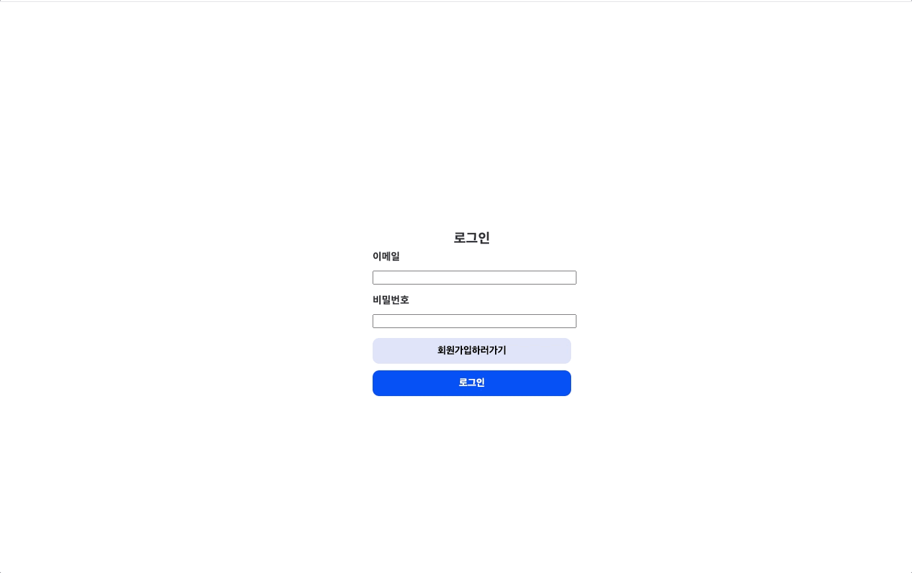

# wante 프리온보딩 프론트엔드 코스 선발과제 To Do List

* [배포링크](http://todolistfe7.s3-website.ap-northeast-2.amazonaws.com/todo)
* AWS S3로 배포하였습니다. 

   
  
   

## 프로젝트 소개

wante 프리온보딩 프론트엔드 코스 선발과제

 

## 기술 스택

| React | styled-components| React Router | AXIOS|
| :--------: | :--------:| :--------: |:------:
|   ![reactjs]    |   ![styledcomponents]|![reactrouter]|![axios]|

 

## 요구 사항 수행
- [x]  과제의 소스코드는 본인의 GitHub 레파지토리에 Public으로 올려주세요. 레파지토리 이름은 wanted-pre-onboarding-fe-7로 생성해주세요.
- [x]  Create React App을 이용해 과제를 구현해주세요.
- [x]  함수 컴포넌트를 이용해서 진행해주세요.
- [x]  README.md 작성은 필수입니다. 아래의 사항은 반드시 포함되도록 해주세요.
  - [x]  프로젝트의 실행 방법
  - [x] 데모 영상은 배포 링크로 대체 가능하며, 배포 시 가산점이 부여됩니다. [배포링크](http://todolistfe7.s3-website.ap-northeast-2.amazonaws.com/todo)

## 과제 

### 1. 로그인 / 회원가입
- [x] '/' 경로에 로그인 / 회원가입 기능을 개발해주세요.
  - [x] 페이지 안에 이메일 입력창, 비밀번호 입력창, 제출 버튼이 포함된 형태로 구성해주세요 
  - 제출 버튼은 로그인일 경우 '로그인', 회원가입일 경우 '회원가입' 버튼으로 구현하였습니다.
  - 로그인과 회원가입을 별도의 경로로 구분하지 않고 '/' 경로에서 isSignInMode의 상태가 true일 경우 로그인, false일 경우 회원가입으로 구현하였습니다.

- Assignment1
- [x] 이메일과 비밀번호의 유효성 검사기능을 구현해주세요.
  - [x] 이메일 조건: @ 포함
  - [x] 비밀번호 조건: 8자 이상
  - [x] 입력된 이메일과 비밀번호가 위 조건을 만족할 때만 버튼이 활성화 되도록 해주세요
  - 회원가입시 이메일 조건, 비밀번호 조건과 추가로 비밀번호와, 비밀번호확인이 같아야지만이 회원가입이 가능하도록  구현하였습니다.

- Assignment2
- [x] 로그인 API를 호출하고, 올바른 응답을 받았을 때 /todo 경로로 이동해주세요.
  - [x] 응답받은 JWT는 로컬 스토리지에 저장해주세요.

- Assignment3
  - [x] 로컬 스토리지에 토큰이 있는 상태로 / 페이지에 접속한다면 /todo 경로로 리다이렉트 시켜주세요
  - [x] 로컬 스토리지에 토큰이 없는 상태로 /todo페이지에 접속한다면 / 경로로 리다이렉트 시켜주세요
- 로컬 스토리지에 'token'의 값으로 토큰이 저장됩니다.

### 2. 투두 리스트
- Assignment4
- [x] /todo경로에 접속하면 투두 리스트의 목록을 볼 수 있도록 해주세요.
- [x] 리스트 페이지에는 투두 리스트의 내용과 완료 여부가 표시되어야 합니다. 
- [x] 리스트 페이지에는 입력창과 추가 버튼이 있고, 추가 버튼을 누르면 입력창의 내용이 새로운 투두 리스트로 추가되도록 해주세요.
- '/todo' 경로에서 추가버튼의 역할은 + 모양의 버튼이 수행합니다.

- Assignment5
- [x] 투두 리스트의 수정, 삭제 기능을 구현해주세요
  - [x]  투두 리스트의 개별 아이템 우측에 수정버튼이 존재하고 해당 버튼을 누르면 수정모드가 활성화되고 투두 리스트의 내용을 수정할 수 있도록 해주세요.
  - [x]  수정모드에서는 개별 아이템의 우측에 제출버튼과 취소버튼이 표시되며 해당 버튼을 통해서 수정 내용을 제출하거나 수정을 취소할 수 있도록 해주세요.
  - [x]  투두 리스트의 개별 아이템 우측에 삭제버튼이 존재하고 해당 버튼을 누르면 투두 리스트가 삭제되도록 해주세요
-  수정 버튼을 눌렀을 때 나오는 취소 버튼, 모달 창을 누른다음에도 취소 버튼을 누를 경우 수정을 취소할 수 있습니다.

### 필수과제 이외 구현한 기능
- [x] 로그아웃 기능
- [x]  필터 기능, All 버튼을 누르면 모든 아이템, Done! 버튼을 누르면 isCompleted가 true인 아이템만, Not yet 버튼은 isCompleted가 false인 값만 조회합니다.
- [x] 미디어쿼리를 이용하여 모바일 사이즈도 고려하여 UI를 제작하였습니다. 

### 

<!-- Stack Icon Refernces -->

[reactjs]: /images/stack/reactjs.png
[styledcomponents]: /images/stack/styledcomponents.png
[reactrouter]: /images/stack/reactrouter.png
[axios]:/images/stack/axios.png
